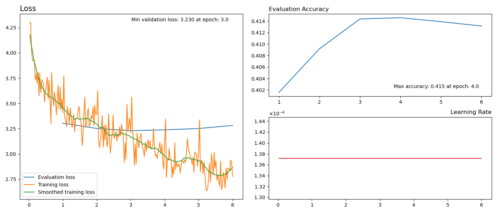

# Title
A python project which, when given a file containing some text (e.g. works of Shakespeare), aims to generate text in a similar style.
It relies on the [Hugging Face Transformers Library](https://huggingface.co/docs/transformers/index) to finetune the GPT-2 124M parameter model or train a model from scratch using GPT-2 architecture and byte-level BPE tokenization. Text is generated as a model is trained and graphs of the validation loss and accuracy at each epoch are produced.

## Prerequisites
To run on an Nvidia GPU the requisite drivers must be installed, a guide to do this on Ubuntu systems can be found [here](https://linuxconfig.org/how-to-install-the-nvidia-drivers-on-ubuntu-20-04-focal-fossa-linux).

It is required to install the Hugging Face: transformers, datasets, and evaluate libraries. This can be achieved using `pip install` followed by the package name.

## Usage
Before running [LM_text_generator.py](LM_text_generator.py) set the location of your text file as well as the output directory for the model in [config.py](config.py). In addition, choose if the text file is to be used to fine-tune or train a model from scratch.

If fine-tuning for the first time, the GPT-2 124M parameter model will the downloaded and cached using the [Hugging Face Transformers Library](https://huggingface.co/docs/transformers/index).

The text file will then be split into a training set and a validation set, which can be configured in [preprocess.py](preprocess.py). 

The number of epochs and other training arguments can be altered in [train.py](train.py) and the [Learning Rate Scheduler](https://huggingface.co/docs/timm/reference/schedulers) can be changed from the constant rate it is currently set to.

Text outputted from the model can be configured in [generate.py](generate.py). This includes: changing the text length, number of sequences, and adding a prompt to begin the text. Text can be generated after the model has been trained by directly running [generate.py](generate.py).

## Output

As the training runs, at each epoch the validation loss and accuracy is calculated. These are presented in a graph along with how the training step size changes. In order to smooth the training loss a [Savitzky–Golay filter](https://en.wikipedia.org/wiki/Savitzky%E2%80%93Golay_filter) is applied.

Above is an example of a graph produced, in this case fine-tuning [shakespeare](https://raw.githubusercontent.com/karpathy/char-rnn/master/data/tinyshakespeare/input.txt). The best accuracy is found after 4 epochs, this is confirmed by the values shown. Below is an example of some generated text.

## Acknowledgments
Parts of the [train.py](train.py) and [preprocess.py](preprocess.py) script are drawn from the [run_clm.py](https://github.com/huggingface/transformers/blob/main/examples/pytorch/language-modeling/run_clm.py) script provided as an example from Hugging Face. Where this is true is show in the comments. 

A tutorial on transformers and language modelling can be found [here](https://huggingface.co/course/chapter1/1). Using an obtained model to generate text is explained by Patrick von Platen in [this tutorial](https://huggingface.co/blog/how-to-generate). Finally, [the Hundred-Page Machine Learning Book by Andriy Burkov](https://www.waterstones.com/book/the-hundred-page-machine-learning-book/andriy-burkov/9781999579517) is very helpful.

## Licence
Apache License - Version 2.0